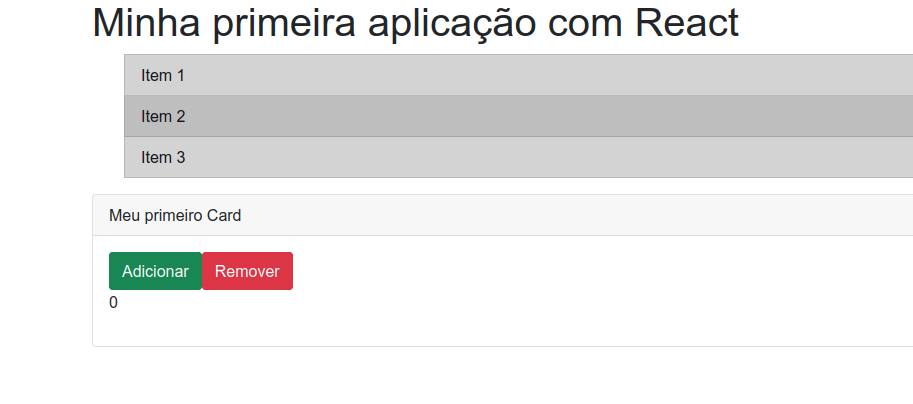

<p align="center">
  <a href="#-tecnologias">Tecnologias</a>&nbsp;&nbsp;&nbsp;|&nbsp;&nbsp;&nbsp;
  <a href="#-projeto">Projeto</a>&nbsp;&nbsp;&nbsp;|&nbsp;&nbsp;&nbsp;
  <a href="#-execucao">Execução</a>&nbsp;&nbsp;&nbsp;
</p>

<br>

<p align="center">
  
</p>

## 🚀 Tecnologias

Esse projeto foi desenvolvido com as seguintes tecnologias:

- ReactJS

## 💻 Projeto

O projeto é simples, pois o intuito é entender a criação de componentes, possibilidades com as props e a utilização do useState. O mesmo foi desenvolvido no curso "Trabalhando com Componentes" realizado através da plataforma Digital Innovation One, ministrado pela professora Nathaly Souza. Não foi abordado CSS e nem HTML, pois o foco era ReactJS.

## 🚀 Execução 

No terminal instale os pacotes necessários:
```
yarn install
```
Logo em seguida rode o comando abaixo para executar em modo dev:
```
yarn start
```


Feito com 💜 👋 [Check out my LinkedIn](https://www.linkedin.com/in/william-souza-0967337b/)